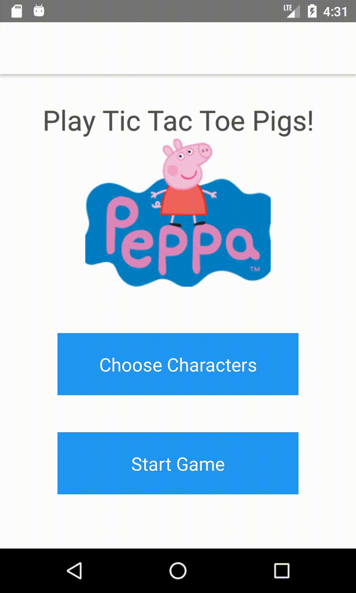

# TicTacToePig
React Native application - game of Tic Tac Toe with Pig characters

# Demo

# Software Requirements to Compile
- Install NodeJS
- Install Android Studio
- Install JDK8
- Install react-native-cli with `npm install -g react-native-cli`
- Set up a Android Virtual Device with any device with Marshmallows 6 sdk

# Run
`$ react-native run-android`

# Code
Start snooping around from App.js. 
P.S. adding Jest tests would be a nice addition for the next steps. I am aso open to suggestions
dev@nuviosoftware.co.uk 

